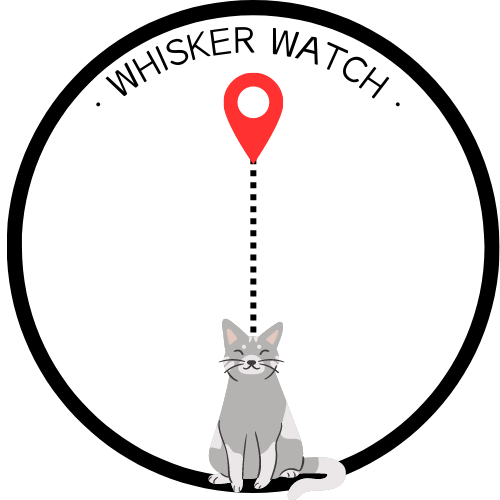

<h1 align="center">Proyecto Final de Grado</h1>
<h2 align="center">Whisker Watch 🐈</h2>
<h5 align="center">Localización de Colonias de Gatos Callejeros</h5>
<h4 align="center">Desarrollo de Aplicaciones Multiplataforma</h4>

 

### Autora🙋🏻‍♀️
Rocío Palao Fernández
### Tutor🙋🏻‍♂️
Jose Luís González Sánchez

---

### Descripción.
Proyecto sobre la localización de colonias de gatos callejeros, para su ayuda y recogida de asociaciones de adopción.
Este proyecto ha sido pensado con el objetivo de ayudar a los gatos callejeros para su supervivencia y que puedan tener una vida mejor mientras vivan en la calle.

Con localización por mapa con señalización de los lugares en los que hay colonias de gatos, puediendo trazar una ruta desde el punto actual hasta el lugar seleccionado, con un foro incluido en cada señalización 
para notificar desperfectos en el lugar, sucesos, instrucciones, etc.

Notificaciones en tiempo real de recogidas de colonias por asociaciones.

Y registro, modificación y eliminación de cuenta para usuarios y asociaciones.

### Base de Datos Utilizada.
[![Mongo][Mongo]][Mongo-url]
### Framework.
[![Ktor][Ktor]][Ktor-url]

<!-- MARKDOWN LINKS & IMAGES -->
<!-- https://www.markdownguide.org/basic-syntax/#reference-style-links -->
[Mongo]: https://img.shields.io/badge/mongodb-green?style=for-the-badge&logo=mongodb&logoColor=white
[Mongo-url]: https://www.mongodb.com/
[Ktor]: https://img.shields.io/badge/ktor-orange?style=for-the-badge&logo=kotlin&logoColor=white
[Ktor-url]:https://ktor.io/
